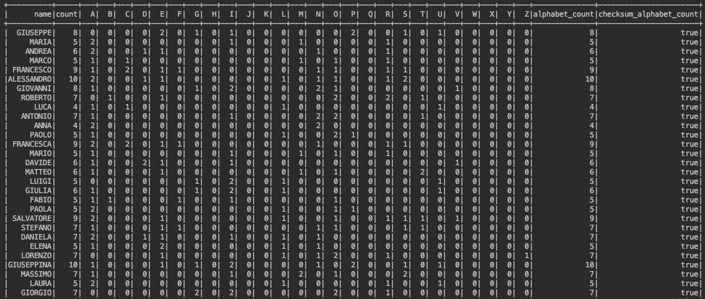

## Name Affinity ##

#### How: ####

1) The application reads 2 file csv  
the first  file with 14k rows (sample names in the world)  
the second file with  9k rows (Italian names)  

2) analysis the data with Spark and add one column for count letters in the whole word

3) adds other column for count how many alphabet letters there are in the this word.

4) adds other column for sum number delle letters da A a Z 

5) checksum to check that point 2 and 4 are the same

6) I expose the result with "affinity.csv" only for a visual matter

#### Now let's talk about numbers: ####
As I said earlier  
the first file with 14000 rows e
the second file with 9000 rows  

by joining the two DataFrame, only 1800 rows are produced.  
(so we have 1800 equal names between the two files)

#### Result: ####

#### Why: ####
I introduced spark for a training, to improvement my skill with join, withColumn, expr.

you could expand this functionality for other many names (se il file csv che stai analizzando sta comodo nel computer, forse Spark non è la soluzione per il tuo caso)

